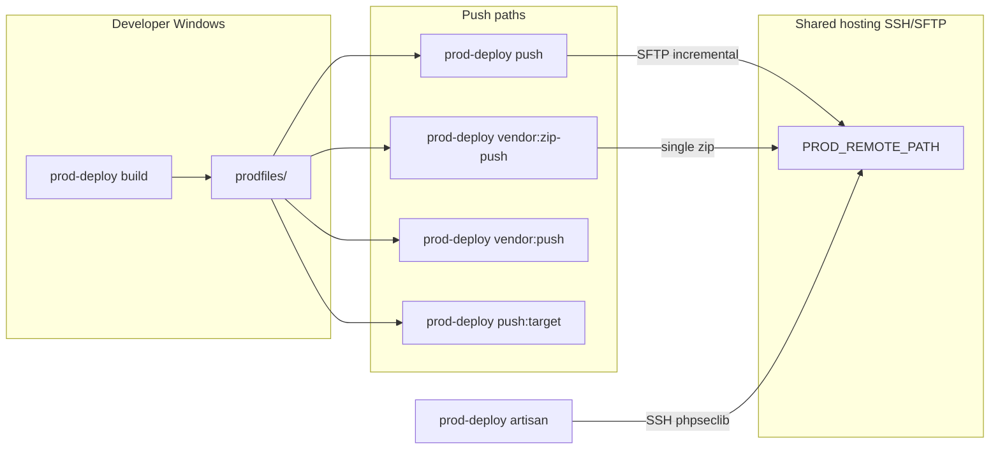

# Architecture

## High-level flow



## Build pipeline

1. Run frontend build (`bun run build` by default, configurable via `deploy/config.php`).
2. Reset `prodfiles/` — keep `vendor/` if `composer.lock` hash matches `deploy/.build-manifest.json` (unless `--force-composer`).
3. Copy application directories (`app`, `bootstrap`, `config`, etc.) applying `exclude-build.txt` rules with path-prefix matching (fixes `public/hot` leaking into prodfiles).
4. Copy root files (`artisan`, `composer.json`, `composer.lock`).
5. Remove `public/hot` if present.
6. Create storage skeleton (`storage/framework/*`, `storage/logs`, etc.) before Composer runs.
7. Run `composer install --no-dev --no-scripts --optimize-autoloader` in prodfiles when vendor is stale.
8. Verify critical paths exist (`vendor/autoload.php`, `public/build/manifest.json` by default).

## Push model

All push commands read from `prodfiles/` and upload to `PROD_REMOTE_PATH` via SFTP.

| Command | Scope | Use case |
|---------|-------|----------|
| `push` | App files only | Routine deploy after code changes |
| `vendor:push` | Changed vendor files | Small dependency updates |
| `vendor:zip-push` | Full vendor as one zip | First deploy, major vendor refresh |
| `push:target` | Explicit paths | Hotfix without full push |

**`push` never uploads vendor.** If vendor changed since last manifest, it warns and suggests `vendor:push` or `vendor:zip-push`.

## Manifests

### Build manifest (`deploy/.build-manifest.json`)

Stores hash of `composer.json` + `composer.lock`. When unchanged, rebuild skips deleting/recreating `prodfiles/vendor/` and skips `composer install`.

### Push manifest (`deploy/.push-manifest.json`)

Maps relative path → MD5 hash of last successful upload. Incremental push only uploads files whose hash differs (or new files). Use `--full` to ignore manifest and upload everything in scope.

Both manifests are gitignored.

## Exclude rules

- **`exclude-build.txt`** — what never enters `prodfiles/` (tests, node_modules, `.env`, dev tooling)
- **`exclude-push.txt`** — what never uploads even if in prodfiles (live `.env`, server logs, bootstrap cache, user uploads)

Project copies in `deploy/` override package defaults. Explicit targets in `push:target` bypass push excludes (but not missing files).

## Authentication

SFTP and SSH use **phpseclib3**:

- Password: `PROD_SSH_PASSWORD` in `deploy/deploy.env`
- Key: `PROD_SSH_KEY` path to private key file

No Windows interactive `ssh` password prompt — credentials come from the env file.

## Remote artisan

`prod-deploy artisan migrate --force` (or `prod-deploy migrate`) opens an SSH session, `cd`s to `PROD_REMOTE_PATH`, and runs `php artisan ...` with escaped arguments. Use `prod-deploy optimize` for config/route/view caching.

## Class layout

```
Application          Project root detection, paths
Configuration        Merged defaults + deploy/config.php
DeployKernel         Build/push/SFTP/SSH logic (ported from deploy scripts)
Console/Cli          Command router
Commands/*           Thin command handlers
```
